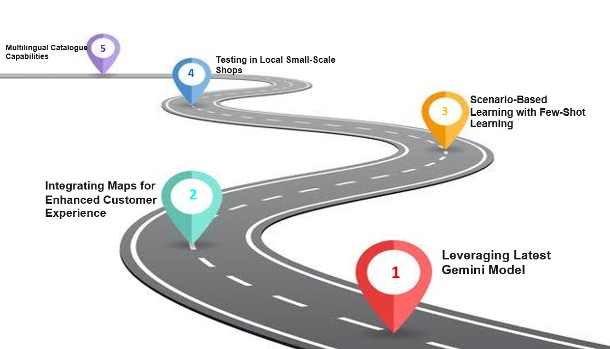

### IKA - Intelligent Kirana Assistant

    Presenting IKA, your compact and intelligent assistant for Kirana that will revolutionize the online experience for your Kirana store. IKA demystifies e-commerce by utilizing Google AI and offers customized legal, financial, and marketing guidance. Utilize consumer insights to personalize your offerings and increase revenue. Searching for partners for delivery or suppliers? You can use IKA's geolocation-based recommendations. Say goodbye to tech complexities;  IKA's multilingual, user-friendly chatbot provides clear responses. Choose IKA as your comprehensive e-commerce ally, propelling your Kirana store to unprecedented success!

## 📝 IKA  Features 💡
    -   Multilingual Support
    -   Demographic Map View
    -   Intuitive Interface
    -   Personalized Assistance

## 💻  FrameWork
    -   FrontEnd
        * ReactJS
        * Redux toolkit
    -   Backend
        * Flask

## 👨🏻‍💻 Technical Stack
    -   Gemini Pro 
        *   gemini-1.5-pro-latest
    -   Large Language Model
    -   Retrival Augumented Generation

## 📚 Languages
    -   Python
    -   ReactJS (Javascript)
    -   Markdown

## </> To Run Frontend File
    
    -   cd Frontend
    -   npm install
    -   npm start
    -   It will open http://localhost:3000 to view it in the browser.

## </> To Run Backend File
    -   cd Backend
    -   IKAgg\Scripts\activate     
    -   flask --app mainFlask --debug run
    -   It will open http://127.0.0.1:5000/ to view it in the browser.

# 📐 Our IKA - Architecture Diagram

# 🎯 Our IKA - Roadmap

# 🔗 To Connect with Us:

### Fazil Mohamed

### Dhaneshvar

### M Thananya

# 🎥 Watch Demo of IKA Here

